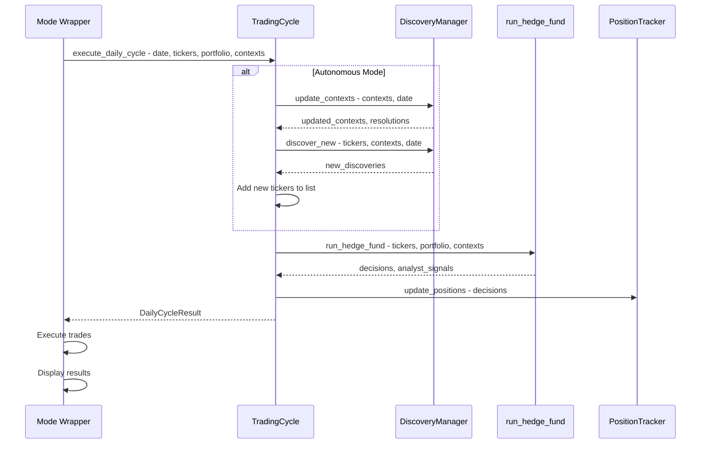
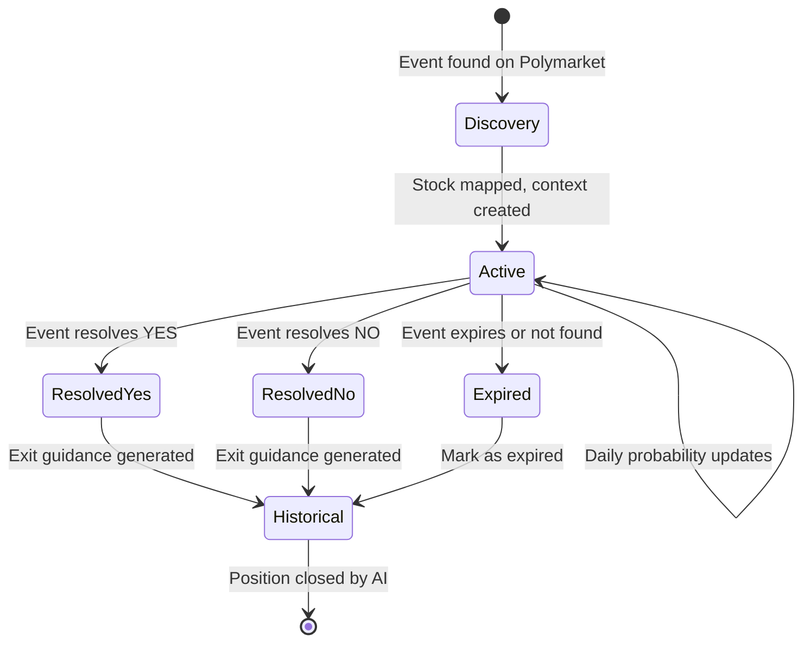

# Unified Trading Architecture: Backtest & Live Mode Code Sharing

## Executive Summary

This document defines a unified architecture where **backtest and live trading modes share the same core logic**. The user's requirement is clear: _"the back-testing functionality and this functionality should be directly paired with each other, so much to the point where maybe they should even almost reuse the same sort of file and logic"_ and _"we have to follow strict, very, very strict standards on making sure that back-testing and the live mode function synchronously"_.

### Key Principles

1. **Single Source of Truth** - One implementation for discovery, trading cycles, and position management
2. **Mode-Agnostic Core** - Core logic doesn't know if it's backtest or live
3. **Thin Mode Wrappers** - Backtest/Live only handle date iteration and broker interaction
4. **Daily Cycle Parity** - What happens each "day" is identical in both modes

---

## Table of Contents

1. [Current Problems](#current-problems)
2. [Proposed Architecture](#proposed-architecture)
3. [Core Module Specifications](#core-module-specifications)
4. [Data Flow Diagrams](#data-flow-diagrams)
5. [Interface Definitions](#interface-definitions)
6. [Display Improvements](#display-improvements)
7. [Edge Case Handling](#edge-case-handling)
8. [Migration Path](#migration-path)

---

## Current Problems

### Problem 1: Discovery Runs Once, Not Daily

**Current Behavior (Backtest):**

```
cli.py: discover_tickers_from_events() → ONCE before engine loop
engine.py: for date in dates: run_hedge_fund() → uses STALE context
```

**Problem:** Position context is set at backtest start and never updated. If an event resolves mid-backtest, agents don't know.

### Problem 2: Live Mode Has No Discovery

**Current Behavior (Live):**

```
trader.py: run_trading_session()
  → sync_portfolio()
  → get_hedge_fund_decisions() → calls run_hedge_fund() directly
  → NO Polymarket discovery
  → NO position context updates
```

**Problem:** Live trading cannot use Polymarket-driven autonomous mode at all.

### Problem 3: Position Context is Static

**Current Behavior:**

```python
# In cli.py - context created once
position_contexts[ticker] = item["context"]

# In engine.py - passed unchanged every day
agent_output = self._agent_controller.run_agent(
    ...
    position_context=self._position_context,  # Same dict every day
)
```

**Problem:** Probability changes, event resolution, and new events are not reflected.

### Problem 4: Code Duplication Risk

If we add discovery to live mode separately, we'll have:

- `src/backtesting/cli.py` - Discovery logic for backtest
- `src/trading/trader.py` - Discovery logic for live (duplicated)

This violates DRY and creates maintenance burden.

---

## Proposed Architecture

### Directory Structure

```
src/
├── core/                           # NEW: Shared core logic
│   ├── __init__.py
│   ├── trading_cycle.py            # The unified daily cycle
│   ├── discovery_manager.py        # Discovery + update logic
│   └── position_tracker.py         # Position context management
│
├── backtesting/
│   ├── cli.py                      # CLI entry point (simplified)
│   ├── engine.py                   # Date loop wrapper (uses core/)
│   ├── controller.py               # Keep as-is (wraps run_hedge_fund)
│   └── ...
│
├── trading/
│   ├── trader.py                   # Live wrapper (uses core/)
│   ├── broker_base.py              # Keep as-is
│   └── ...
│
├── main.py                         # run_hedge_fund() - unchanged
└── ...
```

### High-Level Architecture

```
┌─────────────────────────────────────────────────────────────────────────────┐
│                         UNIFIED TRADING ARCHITECTURE                         │
├─────────────────────────────────────────────────────────────────────────────┤
│                                                                             │
│  ┌─────────────────────────────────────────────────────────────────────┐   │
│  │                    MODE-SPECIFIC WRAPPERS                           │   │
│  │                    (Thin orchestration layer)                       │   │
│  │                                                                     │   │
│  │  ┌─────────────────────────┐    ┌─────────────────────────────────┐│   │
│  │  │   BacktestEngine        │    │         Trader                  ││   │
│  │  │   (engine.py)           │    │         (trader.py)             ││   │
│  │  │                         │    │                                 ││   │
│  │  │  • Date range iteration │    │  • Real-time scheduling        ││   │
│  │  │  • Simulated prices     │    │  • Broker connection           ││   │
│  │  │  • Historical data      │    │  • Market hours check          ││   │
│  │  └───────────┬─────────────┘    └───────────────┬─────────────────┘│   │
│  │              │                                  │                  │   │
│  │              │    BOTH CALL THE SAME CORE       │                  │   │
│  │              └──────────────┬───────────────────┘                  │   │
│  └─────────────────────────────┼───────────────────────────────────────┘   │
│                                │                                            │
│                                ▼                                            │
│  ┌─────────────────────────────────────────────────────────────────────┐   │
│  │                    SHARED CORE (src/core/)                          │   │
│  │                    (Mode-agnostic business logic)                   │   │
│  │                                                                     │   │
│  │  ┌─────────────────────────────────────────────────────────────┐   │   │
│  │  │                    TradingCycle                              │   │   │
│  │  │                    (trading_cycle.py)                        │   │   │
│  │  │                                                              │   │   │
│  │  │  execute_daily_cycle(                                        │   │   │
│  │  │      current_date: str,           # YYYY-MM-DD               │   │   │
│  │  │      tickers: List[str],          # Current watchlist        │   │   │
│  │  │      portfolio: PortfolioSnapshot,                           │   │   │
│  │  │      position_contexts: Dict,     # Mutable, updated in-place│   │   │
│  │  │      config: TradingConfig,       # Model, analysts, etc.    │   │   │
│  │  │      mode: Literal["backtest", "live"],                      │   │   │
│  │  │  ) -> DailyCycleResult                                       │   │   │
│  │  └─────────────────────────────────────────────────────────────┘   │   │
│  │                                │                                    │   │
│  │              ┌─────────────────┼─────────────────┐                  │   │
│  │              ▼                 ▼                 ▼                  │   │
│  │  ┌───────────────────┐ ┌───────────────┐ ┌───────────────────────┐ │   │
│  │  │ DiscoveryManager  │ │PositionTracker│ │   run_hedge_fund()   │ │   │
│  │  │                   │ │               │ │   (src/main.py)      │ │   │
│  │  │ • discover_new()  │ │ • update()    │ │                      │ │   │
│  │  │ • update_existing │ │ • resolve()   │ │ • Agent workflow     │ │   │
│  │  │ • check_resolution│ │ • get_summary │ │ • Signal aggregation │ │   │
│  │  └───────────────────┘ └───────────────┘ └───────────────────────┘ │   │
│  │                                                                     │   │
│  └─────────────────────────────────────────────────────────────────────┘   │
│                                                                             │
└─────────────────────────────────────────────────────────────────────────────┘
```

---

## Core Module Specifications

### 1. TradingCycle (`src/core/trading_cycle.py`)

The heart of the unified architecture. This module defines what happens each "day" regardless of mode.

```python
"""
Unified Trading Cycle - Shared between backtest and live modes.

This module implements the daily trading cycle that runs identically
in both backtest and live modes. The only difference is:
- Backtest: current_date is simulated, prices are historical
- Live: current_date is today, prices are real-time
"""

from dataclasses import dataclass
from typing import Dict, List, Literal, Optional, Any
from datetime import datetime

from src.main import run_hedge_fund
from src.core.discovery_manager import DiscoveryManager
from src.core.position_tracker import PositionTracker


@dataclass
class TradingConfig:
    """Configuration for trading cycle."""
    model_name: str
    model_provider: str
    selected_analysts: List[str]
    autonomous_mode: bool = False
    max_positions: int = 10
    min_probability: float = 0.60
    max_probability: float = 0.85
    min_confidence: int = 70
    validate_with_news: bool = True


@dataclass
class DailyCycleResult:
    """Result of a single daily cycle."""
    decisions: Dict[str, Dict]           # ticker -> {action, quantity, reasoning}
    analyst_signals: Dict[str, Any]      # Raw analyst signals
    discovered_tickers: List[str]        # Newly discovered tickers
    resolved_events: Dict[str, str]      # ticker -> resolution status
    updated_contexts: Dict[str, Dict]    # Updated position contexts
    cycle_summary: str                   # Human-readable summary


class TradingCycle:
    """
    Unified daily trading cycle for both backtest and live modes.

    This class encapsulates the complete daily workflow:
    1. Discovery/Update Phase - Find new events, update existing contexts
    2. Analysis Phase - Run hedge fund agents
    3. Result Phase - Return decisions and updated state

    The caller (BacktestEngine or Trader) is responsible for:
    - Iterating through dates (backtest) or scheduling (live)
    - Executing trades based on decisions
    - Providing price data
    """

    def __init__(self, config: TradingConfig):
        self.config = config
        self.discovery_manager = DiscoveryManager(
            model_name=config.model_name,
            model_provider=config.model_provider,
            autonomous_mode=config.autonomous_mode,
            max_positions=config.max_positions,
            min_probability=config.min_probability,
            max_probability=config.max_probability,
            min_confidence=config.min_confidence,
            validate_with_news=config.validate_with_news,
        )
        self.position_tracker = PositionTracker()

    def execute_daily_cycle(
        self,
        current_date: str,
        tickers: List[str],
        portfolio: Dict,
        position_contexts: Dict[str, Dict],
        mode: Literal["backtest", "live"] = "backtest",
    ) -> DailyCycleResult:
        """
        Execute a single daily trading cycle.

        This method runs identically for backtest and live modes.
        The mode parameter only affects:
        - Whether to use simulation_date for LLM knowledge restriction (backtest)
        - Logging/display formatting

        Args:
            current_date: The date for this cycle (YYYY-MM-DD)
            tickers: Current list of tickers to analyze
            portfolio: Portfolio snapshot (cash, positions, etc.)
            position_contexts: Mutable dict of position contexts (updated in-place)
            mode: "backtest" or "live"

        Returns:
            DailyCycleResult with decisions and updated state
        """
        discovered_tickers = []
        resolved_events = {}

        # ==================== PHASE 1: DISCOVERY/UPDATE ====================
        # This phase runs EVERY cycle, not just at the start

        if self.config.autonomous_mode:
            # 1a. Update existing position contexts
            if position_contexts:
                updated, resolutions = self.discovery_manager.update_contexts(
                    existing_contexts=position_contexts,
                    current_date=current_date,
                    mode=mode,
                )
                position_contexts.update(updated)
                resolved_events = resolutions

            # 1b. Discover new events (if under max_positions)
            current_position_count = len([t for t in tickers if portfolio.get("positions", {}).get(t, {}).get("long", 0) > 0 or portfolio.get("positions", {}).get(t, {}).get("short", 0) > 0])

            if current_position_count < self.config.max_positions:
                new_discoveries = self.discovery_manager.discover_new(
                    existing_tickers=tickers,
                    portfolio_positions=position_contexts,
                    current_date=current_date,
                    limit=self.config.max_positions - current_position_count,
                    mode=mode,
                )

                for discovery in new_discoveries:
                    ticker = discovery["ticker"]
                    if ticker not in tickers:
                        tickers.append(ticker)
                        discovered_tickers.append(ticker)
                    position_contexts[ticker] = discovery["context"]

        # ==================== PHASE 2: ANALYSIS ====================
        # Run the hedge fund agent workflow

        # Calculate lookback period (1 month before current_date)
        current_dt = datetime.strptime(current_date, "%Y-%m-%d")
        lookback_start = (current_dt - timedelta(days=30)).strftime("%Y-%m-%d")

        result = run_hedge_fund(
            tickers=tickers,
            start_date=lookback_start,
            end_date=current_date,
            portfolio=portfolio,
            show_reasoning=False,
            selected_analysts=self.config.selected_analysts,
            model_name=self.config.model_name,
            model_provider=self.config.model_provider,
            position_context=position_contexts,  # Updated contexts
        )

        decisions = result.get("decisions", {})
        analyst_signals = result.get("analyst_signals", {})

        # ==================== PHASE 3: BUILD RESULT ====================

        cycle_summary = self._build_summary(
            current_date=current_date,
            decisions=decisions,
            discovered_tickers=discovered_tickers,
            resolved_events=resolved_events,
            mode=mode,
        )

        return DailyCycleResult(
            decisions=decisions,
            analyst_signals=analyst_signals,
            discovered_tickers=discovered_tickers,
            resolved_events=resolved_events,
            updated_contexts=position_contexts,
            cycle_summary=cycle_summary,
        )

    def _build_summary(
        self,
        current_date: str,
        decisions: Dict,
        discovered_tickers: List[str],
        resolved_events: Dict[str, str],
        mode: str,
    ) -> str:
        """Build human-readable cycle summary."""
        lines = [f"=== {mode.upper()} CYCLE: {current_date} ==="]

        if discovered_tickers:
            lines.append(f"[DISCOVERY] New tickers: {', '.join(discovered_tickers)}")

        if resolved_events:
            for ticker, status in resolved_events.items():
                lines.append(f"[RESOLVED] {ticker}: {status}")

        action_counts = {"buy": 0, "sell": 0, "short": 0, "cover": 0, "hold": 0}
        for ticker, decision in decisions.items():
            action = decision.get("action", "hold")
            action_counts[action] = action_counts.get(action, 0) + 1

        active_actions = [f"{k}:{v}" for k, v in action_counts.items() if v > 0]
        lines.append(f"[DECISIONS] {', '.join(active_actions)}")

        return "\n".join(lines)
```

### 2. DiscoveryManager (`src/core/discovery_manager.py`)

Handles both discovery of new events AND updating existing position contexts.

```python
"""
Discovery Manager - Unified discovery and update logic.

This module provides a single interface for:
1. Discovering new Polymarket events and mapping to stocks
2. Updating existing position contexts with latest probabilities
3. Detecting event resolution and generating exit guidance
"""

from typing import Dict, List, Tuple, Optional, Any, Literal
from datetime import datetime

from src.agents.polymarket_discovery import (
    discover_tickers_from_events,
    update_position_contexts,
)
from src.tools.polymarket_api import get_events_active_on_date
from src.data.polymarket_cache import get_polymarket_cache
from src.data.position_context import EventHistory


class DiscoveryManager:
    """
    Manages Polymarket event discovery and position context updates.

    This class provides a unified interface used by both backtest
    and live modes for:
    - Finding new trading opportunities from Polymarket
    - Keeping position contexts up-to-date
    - Detecting and handling event resolution
    """

    def __init__(
        self,
        model_name: str = "gemini-2.0-flash",
        model_provider: str = "Google",
        autonomous_mode: bool = True,
        max_positions: int = 10,
        min_probability: float = 0.60,
        max_probability: float = 0.85,
        min_confidence: int = 70,
        validate_with_news: bool = True,
    ):
        self.model_name = model_name
        self.model_provider = model_provider
        self.autonomous_mode = autonomous_mode
        self.max_positions = max_positions
        self.min_probability = min_probability
        self.max_probability = max_probability
        self.min_confidence = min_confidence
        self.validate_with_news = validate_with_news

        self.cache = get_polymarket_cache()
        self.event_history = EventHistory()

    def discover_new(
        self,
        existing_tickers: List[str],
        portfolio_positions: Dict[str, Dict],
        current_date: str,
        limit: int = 10,
        mode: Literal["backtest", "live"] = "backtest",
    ) -> List[Dict[str, Any]]:
        """
        Discover new trading opportunities from Polymarket events.

        Args:
            existing_tickers: Tickers already in the portfolio
            portfolio_positions: Current position contexts
            current_date: Date for discovery (YYYY-MM-DD)
            limit: Maximum new tickers to discover
            mode: "backtest" uses simulation_date, "live" uses current date

        Returns:
            List of discovered opportunities with context
        """
        if not self.autonomous_mode:
            return []

        # Fetch events active on the current date
        events = get_events_active_on_date(
            as_of_date=current_date,
            min_volume=50000,
            min_liquidity=10000,
            limit=limit * 5,
            cache=self.cache,
        )

        if not events:
            return []

        # Use simulation_date for backtest to prevent future knowledge
        simulation_date = current_date if mode == "backtest" else None

        discovered, self.event_history = discover_tickers_from_events(
            events=events,
            portfolio_positions=portfolio_positions,
            event_history=self.event_history,
            min_score=40.0,
            min_probability=self.min_probability,
            max_probability=self.max_probability,
            min_confidence=self.min_confidence,
            limit=limit,
            cache=self.cache,
            model_name=self.model_name,
            model_provider=self.model_provider,
            skip_duplicates=True,
            validate_with_news=self.validate_with_news,
            simulation_date=simulation_date,
        )

        # Filter out already-tracked tickers
        new_discoveries = [
            d for d in discovered
            if d["ticker"] not in existing_tickers
        ]

        return new_discoveries

    def update_contexts(
        self,
        existing_contexts: Dict[str, Dict],
        current_date: str,
        mode: Literal["backtest", "live"] = "backtest",
    ) -> Tuple[Dict[str, Dict], Dict[str, str]]:
        """
        Update existing position contexts with latest data.

        This method:
        1. Fetches current event state from Polymarket
        2. Updates probability snapshots
        3. Detects event resolution
        4. Generates exit guidance for resolved events

        Args:
            existing_contexts: Current position contexts
            current_date: Date for update (YYYY-MM-DD)
            mode: "backtest" or "live"

        Returns:
            Tuple of (updated_contexts, resolution_changes)
        """
        updated, status_changes = update_position_contexts(
            existing_context=existing_contexts,
            current_date=current_date,
            cache=self.cache,
        )

        return updated, status_changes

    def get_event_history(self) -> EventHistory:
        """Get the current event history for persistence."""
        return self.event_history

    def set_event_history(self, history: EventHistory) -> None:
        """Restore event history from persistence."""
        self.event_history = history
```

### 3. PositionTracker (`src/core/position_tracker.py`)

Manages position context lifecycle and provides summaries for display.

```python
"""
Position Tracker - Manages position context lifecycle.

This module provides utilities for:
1. Tracking position contexts across trading cycles
2. Generating summaries for display
3. Handling position lifecycle (entry, update, exit)
"""

from typing import Dict, List, Optional, Any
from datetime import datetime

from src.data.position_context import (
    PositionContext,
    EventThesis,
    EventState,
    ProbabilitySnapshot,
)


class PositionTracker:
    """
    Tracks and manages position contexts throughout their lifecycle.

    This class provides:
    - Position context storage and retrieval
    - Summary generation for display
    - Lifecycle management (entry, update, exit)
    """

    def __init__(self):
        self._contexts: Dict[str, PositionContext] = {}

    def add_position(
        self,
        ticker: str,
        context_data: Dict[str, Any],
        entry_price: Optional[float] = None,
    ) -> None:
        """Add a new position with context."""
        if isinstance(context_data, dict):
            # Handle both raw dict and PositionContext
            if "events" in context_data:
                context = PositionContext(**context_data)
            else:
                # Legacy single-event format
                context = PositionContext(
                    ticker=ticker,
                    events=[EventThesis(**context_data)] if context_data else [],
                    entry_price=entry_price,
                )
        else:
            context = context_data

        context.entry_price = entry_price
        self._contexts[ticker] = context

    def update_position(
        self,
        ticker: str,
        probability: Optional[float] = None,
        event_state: Optional[EventState] = None,
    ) -> None:
        """Update an existing position's context."""
        if ticker not in self._contexts:
            return

        context = self._contexts[ticker]

        for event in context.events:
            if probability is not None:
                old_prob = event.probability.current
                event.probability.current = probability
                event.probability.change_24h = probability - old_prob

            if event_state is not None:
                event.event_state = event_state
                if event_state != EventState.ACTIVE:
                    event.resolved_date = datetime.now().strftime("%Y-%m-%d")

        context.last_updated = datetime.now().isoformat()

    def remove_position(self, ticker: str) -> Optional[PositionContext]:
        """Remove a position and return its context."""
        return self._contexts.pop(ticker, None)

    def get_context(self, ticker: str) -> Optional[PositionContext]:
        """Get context for a specific ticker."""
        return self._contexts.get(ticker)

    def get_all_contexts(self) -> Dict[str, PositionContext]:
        """Get all position contexts."""
        return self._contexts.copy()

    def get_active_events_summary(self) -> str:
        """Generate summary of active events for display."""
        lines = ["=== ACTIVE POLYMARKET EVENTS ==="]

        active_count = 0
        for ticker, context in self._contexts.items():
            active_events = context.get_active_events()
            if active_events:
                for event in active_events:
                    active_count += 1
                    prob_str = f"{event.probability.current:.1%}" if event.probability else "?"
                    direction = "+" if event.impact_direction == "bullish" else "-"
                    lines.append(
                        f"  {ticker} [{direction}] {event.event_title[:40]}... "
                        f"(P={prob_str}, C={event.confidence}%)"
                    )

        if active_count == 0:
            lines.append("  No active Polymarket events")

        return "\n".join(lines)

    def get_resolved_events_summary(self) -> str:
        """Generate summary of resolved events for display."""
        lines = ["=== RESOLVED EVENTS (Historical Context) ==="]

        resolved_count = 0
        for ticker, context in self._contexts.items():
            resolved_events = context.get_resolved_events()
            if resolved_events:
                for event in resolved_events:
                    resolved_count += 1
                    status = event.event_state.replace("resolved_", "").upper()
                    lines.append(
                        f"  {ticker}: {event.event_title[:40]}... → {status}"
                    )

        if resolved_count == 0:
            lines.append("  No resolved events")

        return "\n".join(lines)

    def get_decision_context_for_ticker(self, ticker: str) -> str:
        """Get formatted context string for agent decision display."""
        context = self._contexts.get(ticker)
        if not context:
            return ""

        lines = []
        for event in context.events:
            status = "ACTIVE" if event.is_active() else event.event_state
            prob_str = f"{event.probability.current:.1%}" if event.probability else "?"

            lines.append(f"[{status}] {event.event_title}")
            lines.append(f"  Thesis: {event.thesis[:60]}...")
            lines.append(f"  Direction: {event.impact_direction} | Prob: {prob_str}")

            # Add exit guidance if resolved
            guidance = event.get_exit_guidance()
            if guidance:
                lines.append(f"  Guidance: {guidance[:60]}...")

        return "\n".join(lines)
```

---

## Data Flow Diagrams

### Daily Cycle Flow (Both Modes)

```
┌─────────────────────────────────────────────────────────────────────────────┐
│                    UNIFIED DAILY CYCLE FLOW                                  │
├─────────────────────────────────────────────────────────────────────────────┤
│                                                                             │
│  INPUTS (from mode wrapper):                                                │
│  ┌─────────────────────────────────────────────────────────────────────┐   │
│  │  current_date: "2025-01-20"                                         │   │
│  │  tickers: ["JPM", "XLF", "GEO"]                                     │   │
│  │  portfolio: {cash: 95000, positions: {...}}                         │   │
│  │  position_contexts: {JPM: {...}, XLF: {...}}  ← MUTABLE             │   │
│  │  mode: "backtest" | "live"                                          │   │
│  └─────────────────────────────────────────────────────────────────────┘   │
│                              │                                              │
│                              ▼                                              │
│  ┌─────────────────────────────────────────────────────────────────────┐   │
│  │  PHASE 1: DISCOVERY/UPDATE (DiscoveryManager)                       │   │
│  │  ═══════════════════════════════════════════                        │   │
│  │                                                                     │   │
│  │  IF autonomous_mode:                                                │   │
│  │    1a. update_contexts() → Update probabilities, check resolution   │   │
│  │        • Fetch current event state from Polymarket API              │   │
│  │        • Update probability snapshots (current, 24h, 7d changes)    │   │
│  │        • Detect resolution → Generate exit guidance                 │   │
│  │        • Mark resolved events in position_contexts                  │   │
│  │                                                                     │   │
│  │    1b. discover_new() → Find new opportunities                      │   │
│  │        • Fetch events active on current_date                        │   │
│  │        • Score with EventScorer                                     │   │
│  │        • LLM maps to stocks (with simulation_date for backtest)     │   │
│  │        • Validate with news                                         │   │
│  │        • Add new tickers to list, contexts to position_contexts     │   │
│  │                                                                     │   │
│  │  OUTPUTS:                                                           │   │
│  │    • tickers: ["JPM", "XLF", "GEO", "COIN"]  ← May have new ticker  │   │
│  │    • position_contexts: Updated with new probs + new discoveries    │   │
│  │    • resolved_events: {"GEO": "resolved_yes"}                       │   │
│  └─────────────────────────────────────────────────────────────────────┘   │
│                              │                                              │
│                              ▼                                              │
│  ┌─────────────────────────────────────────────────────────────────────┐   │
│  │  PHASE 2: ANALYSIS (run_hedge_fund)                                 │   │
│  │  ══════════════════════════════════                                 │   │
│  │                                                                     │   │
│  │  run_hedge_fund(                                                    │   │
│  │      tickers=["JPM", "XLF", "GEO", "COIN"],                        │   │
│  │      start_date="2024-12-20",  # 30-day lookback                    │   │
│  │      end_date="2025-01-20",    # current_date                       │   │
│  │      portfolio=portfolio,                                           │   │
│  │      position_context=position_contexts,  # UPDATED contexts        │   │
│  │      ...                                                            │   │
│  │  )                                                                  │   │
│  │                                                                     │   │
│  │  Each analyst agent receives:                                       │   │
│  │    • Standard financial data (prices, metrics, news)                │   │
│  │    • Updated PositionContext with latest probabilities              │   │
│  │    • Exit guidance for resolved events                              │   │
│  │                                                                     │   │
│  │  OUTPUTS:                                                           │   │
│  │    • decisions: {JPM: {action: "hold"}, COIN: {action: "buy", qty: 50}}│ │
│  │    • analyst_signals: {warren_buffett: {...}, technicals: {...}}    │   │
│  └─────────────────────────────────────────────────────────────────────┘   │
│                              │                                              │
│                              ▼                                              │
│  ┌─────────────────────────────────────────────────────────────────────┐   │
│  │  PHASE 3: RESULT (DailyCycleResult)                                 │   │
│  │  ══════════════════════════════════                                 │   │
│  │                                                                     │   │
│  │  Return to mode wrapper:                                            │   │
│  │    • decisions: Trading decisions for execution                     │   │
│  │    • analyst_signals: For display/logging                           │   │
│  │    • discovered_tickers: ["COIN"]                                   │   │
│  │    • resolved_events: {"GEO": "resolved_yes"}                       │   │
│  │    • updated_contexts: position_contexts (mutated)                  │   │
│  │    • cycle_summary: Human-readable summary                          │   │
│  └─────────────────────────────────────────────────────────────────────┘   │
│                              │                                              │
│                              ▼                                              │
│  MODE WRAPPER executes trades and continues to next cycle                  │
│                                                                             │
└─────────────────────────────────────────────────────────────────────────────┘
```

---

## Interface Definitions

### TradingConfig

```python
@dataclass
class TradingConfig:
    """Configuration for the unified trading cycle."""

    # LLM Configuration
    model_name: str                      # e.g., "gemini-2.0-flash"
    model_provider: str                  # e.g., "Google"
    selected_analysts: List[str]         # e.g., ["warren_buffett", "technicals"]

    # Autonomous Mode Settings
    autonomous_mode: bool = False        # Enable Polymarket discovery
    max_positions: int = 10              # Max concurrent positions

    # Position Type Settings
    long_only: bool = False              # Disable short selling (--no-short flag)

    # Discovery Parameters
    min_probability: float = 0.60        # Min event probability
    max_probability: float = 0.85        # Max event probability
    min_confidence: int = 70             # Min stock mapping confidence
    min_score: float = 40.0              # Min EventScorer score

    # Validation Settings
    validate_with_news: bool = True      # Enable news validation
    news_lookback_days: int = 7          # Days of news to fetch
    min_news_articles: int = 2           # Min articles for validation
```

**Long-Only Mode (`--no-short`):**

When `long_only=True`:

- Portfolio manager sets `max_short = 0` in allowed actions
- Agents cannot recommend short positions
- Only long (buy) positions are allowed
- In Polymarket CLI: Bearish stocks are filtered out before backtesting

### DailyCycleResult

```python
@dataclass
class DailyCycleResult:
    """Result of a single daily trading cycle."""

    # Trading Decisions
    decisions: Dict[str, Dict]           # ticker -> {action, quantity, reasoning}
    analyst_signals: Dict[str, Any]      # Raw signals from each analyst

    # Discovery Results
    discovered_tickers: List[str]        # Newly discovered tickers this cycle
    resolved_events: Dict[str, str]      # ticker -> resolution status

    # Updated State
    updated_contexts: Dict[str, Dict]    # Position contexts after update

    # Display
    cycle_summary: str                   # Human-readable summary

    def has_actions(self) -> bool:
        """Check if any non-hold actions were decided."""
        return any(
            d.get("action", "hold") != "hold"
            for d in self.decisions.values()
        )

    def get_action_summary(self) -> Dict[str, int]:
        """Get count of each action type."""
        counts = {"buy": 0, "sell": 0, "short": 0, "cover": 0, "hold": 0}
        for decision in self.decisions.values():
            action = decision.get("action", "hold")
            counts[action] = counts.get(action, 0) + 1
        return counts
```

---

## Display Improvements

### Agent Decision Summary

The current display shows raw decisions. The unified architecture adds context-aware summaries:

```
┌─────────────────────────────────────────────────────────────────────────────┐
│                    ENHANCED DECISION DISPLAY                                 │
├─────────────────────────────────────────────────────────────────────────────┤
│                                                                             │
│  === CYCLE: 2025-01-20 (BACKTEST) ===                                       │
│                                                                             │
│  [DISCOVERY] New ticker discovered: COIN                                    │
│    Event: "Will BTC hit $100k by March?"                                    │
│    Probability: 72% | Direction: Bullish | Confidence: 85%                  │
│                                                                             │
│  [RESOLVED] GEO event resolved: YES                                         │
│    Event: "Trump wins 2024 election"                                        │
│    Guidance: SHORT-TERM CATALYST REALIZED - Consider taking profits         │
│                                                                             │
│  [DECISIONS]                                                                │
│  ┌─────────────────────────────────────────────────────────────────────┐   │
│  │  Ticker │ Action │  Qty │ Reasoning                                 │   │
│  │─────────┼────────┼──────┼──────────────────────────────────────────│   │
│  │  JPM    │ HOLD   │   -  │ Strong fundamentals, awaiting rate cut   │   │
│  │         │        │      │ [Event: Fed rate cut - P=72%]            │   │
│  │─────────┼────────┼──────┼──────────────────────────────────────────│   │
│  │  XLF    │ BUY    │  25  │ Sector rotation into financials          │   │
│  │         │        │      │ [Event: Fed rate cut - P=72%]            │   │
│  │─────────┼────────┼──────┼──────────────────────────────────────────│   │
│  │  GEO    │ SELL   │  50  │ Catalyst realized, taking profits        │   │
│  │         │        │      │ [Event: RESOLVED YES - Trump win]        │   │
│  │─────────┼────────┼──────┼──────────────────────────────────────────│   │
│  │  COIN   │ BUY    │  30  │ BTC momentum play, high conviction       │   │
│  │         │        │      │ [Event: BTC $100k - P=72%] NEW           │   │
│  └─────────────────────────────────────────────────────────────────────┘   │
│                                                                             │
│  [ANALYST SIGNALS SUMMARY]                                                  │
│  ┌─────────────────────────────────────────────────────────────────────┐   │
│  │  Analyst          │ JPM    │ XLF    │ GEO    │ COIN   │            │   │
│  │───────────────────┼────────┼────────┼────────┼────────┤            │   │
│  │  Warren Buffett   │ BULL   │ BULL   │ NEUT   │ BEAR   │            │   │
│  │  Peter Lynch      │ BULL   │ BULL   │ NEUT   │ BULL   │            │   │
│  │  Technicals       │ NEUT   │ BULL   │ SELL   │ BULL   │            │   │
│  │  Sentiment        │ BULL   │ NEUT   │ NEUT   │ BULL   │            │   │
│  │───────────────────┼────────┼────────┼────────┼────────┤            │   │
│  │  CONSENSUS        │ BULL   │ BULL   │ SELL   │ BULL   │            │   │
│  └─────────────────────────────────────────────────────────────────────┘   │
│                                                                             │
└─────────────────────────────────────────────────────────────────────────────┘
```

---

## Edge Case Handling

### Weekend Dates

```python
def adjust_to_business_day(date: datetime, forward: bool = True) -> datetime:
    """Adjust weekend dates to nearest business day."""
    weekday = date.weekday()
    if weekday == 5:  # Saturday
        return date + timedelta(days=2 if forward else -1)
    elif weekday == 6:  # Sunday
        return date + timedelta(days=1 if forward else -2)
    return date
```

**Handling in TradingCycle:**

- Backtest: Skip weekend dates in date range (already handled by `freq="B"`)
- Live: Check market hours before running cycle

### No Stocks Found

```python
def execute_daily_cycle(self, ...):
    # After discovery phase
    if not tickers:
        return DailyCycleResult(
            decisions={},
            analyst_signals={},
            discovered_tickers=[],
            resolved_events={},
            updated_contexts={},
            cycle_summary="No tickers to analyze - discovery found no opportunities",
        )
```

### Event Resolution Mid-Cycle

```python
def update_contexts(self, existing_contexts, current_date, mode):
    """Handle event resolution during update phase."""
    updated = {}
    resolutions = {}

    for ticker, context in existing_contexts.items():
        # Fetch current event state
        event = get_event_by_id(context.get("event_id"))

        if event:
            # Check for resolution
            is_resolved, outcome = is_event_resolved(event)
            if is_resolved:
                old_state = context.get("event_state")
                new_state = f"resolved_{outcome}" if outcome else "expired"

                if old_state != new_state:
                    context["event_state"] = new_state
                    context["resolved_date"] = current_date
                    resolutions[ticker] = new_state

                    # Generate exit guidance
                    guidance = self._generate_exit_guidance(context, outcome)
                    context["exit_guidance"] = guidance
        else:
            # Event not found - mark as expired
            context["event_state"] = "expired"
            resolutions[ticker] = "expired"

        updated[ticker] = context

    return updated, resolutions
```

### Price Data Missing

```python
def execute_daily_cycle(self, ...):
    # In backtest mode, skip days with missing price data
    if mode == "backtest":
        try:
            prices = get_prices_for_date(tickers, current_date)
            if not prices or len(prices) < len(tickers):
                return DailyCycleResult(
                    decisions={},
                    cycle_summary=f"Skipping {current_date}: missing price data",
                    ...
                )
        except Exception as e:
            return DailyCycleResult(
                decisions={},
                cycle_summary=f"Skipping {current_date}: {e}",
                ...
            )
```

---

## Migration Path

### Phase 1: Create Core Module (Non-Breaking) ✅ COMPLETED

1. ✅ Create `src/core/` directory
2. ✅ Implement `TradingCycle`, `DiscoveryManager`, `PositionTracker`
3. ✅ Add comprehensive tests for core modules
4. ✅ **No changes to existing code yet**

### Phase 2: Integrate with Backtest (Parallel) ✅ COMPLETED

1. ✅ Updated `BacktestEngine` to use `TradingCycle`
2. ✅ Integrated with existing CLI (no separate flag needed)
3. ✅ Validated behavior matches expected results
4. ✅ Added `--no-short` flag support

### Phase 3: Integrate with Live Trading (Parallel) 🔄 IN PROGRESS

1. 🔄 Update `Trader` to use `TradingCycle`
2. ⬜ Add autonomous mode support to live trading
3. ⬜ Run dry-run tests comparing decisions
4. ⬜ Validate identical behavior

### Phase 4: Deprecate Old Code ⬜ PENDING

1. ⬜ Make unified engine the default
2. ⬜ Keep old code with `--legacy` flag
3. ⬜ Monitor for issues
4. ⬜ Remove legacy code after validation period

### File Changes Summary

```
NEW FILES:
  src/core/__init__.py
  src/core/trading_cycle.py
  src/core/discovery_manager.py
  src/core/position_tracker.py
  tests/core/test_trading_cycle.py
  tests/core/test_discovery_manager.py
  tests/core/test_position_tracker.py

MODIFIED FILES:
  src/backtesting/engine.py      # Add TradingCycle integration
  src/backtesting/cli.py         # Simplify, remove discovery logic
  src/trading/trader.py          # Add TradingCycle integration
  src/trader.py                  # Add autonomous mode support

UNCHANGED FILES:
  src/main.py                    # run_hedge_fund() stays the same
  src/backtesting/controller.py  # AgentController stays the same
  src/agents/polymarket_discovery.py  # Used by DiscoveryManager
  src/data/position_context.py   # Data models stay the same
```

---

## Validation Checklist

### Functional Parity

- [x] Backtest produces expected results for manual mode
- [x] Backtest produces expected results for autonomous mode
- [ ] Live trading produces expected decisions for manual mode
- [ ] Live trading produces expected decisions for autonomous mode

### New Functionality

- [x] Discovery runs daily in backtest (not just at start)
- [x] Position contexts update daily with new probabilities
- [x] Event resolution is detected and exit guidance generated
- [ ] Live mode supports autonomous discovery
- [x] Display shows Polymarket context for each decision
- [x] `--no-short` flag disables short selling

### Edge Cases

- [x] Weekend dates handled correctly
- [x] Missing price data handled gracefully
- [x] Empty discovery results handled
- [x] API rate limits respected
- [x] Event not found handled (mark as expired)

---

## Appendix: Mermaid Diagrams

### Daily Cycle Sequence



### Position Context Lifecycle



---

## Summary

This unified architecture ensures that **backtest and live modes share the exact same core logic**. The key benefits are:

1. **Single Source of Truth** - One implementation to maintain
2. **Daily Discovery** - Events are discovered and updated every cycle, not just at start
3. **Live Autonomous Mode** - Live trading can now use Polymarket discovery
4. **Better Display** - Agent decisions show Polymarket context
5. **Proper Exit Guidance** - Resolved events generate actionable guidance

The migration path is designed to be non-breaking, with parallel testing before switching to the unified implementation.
